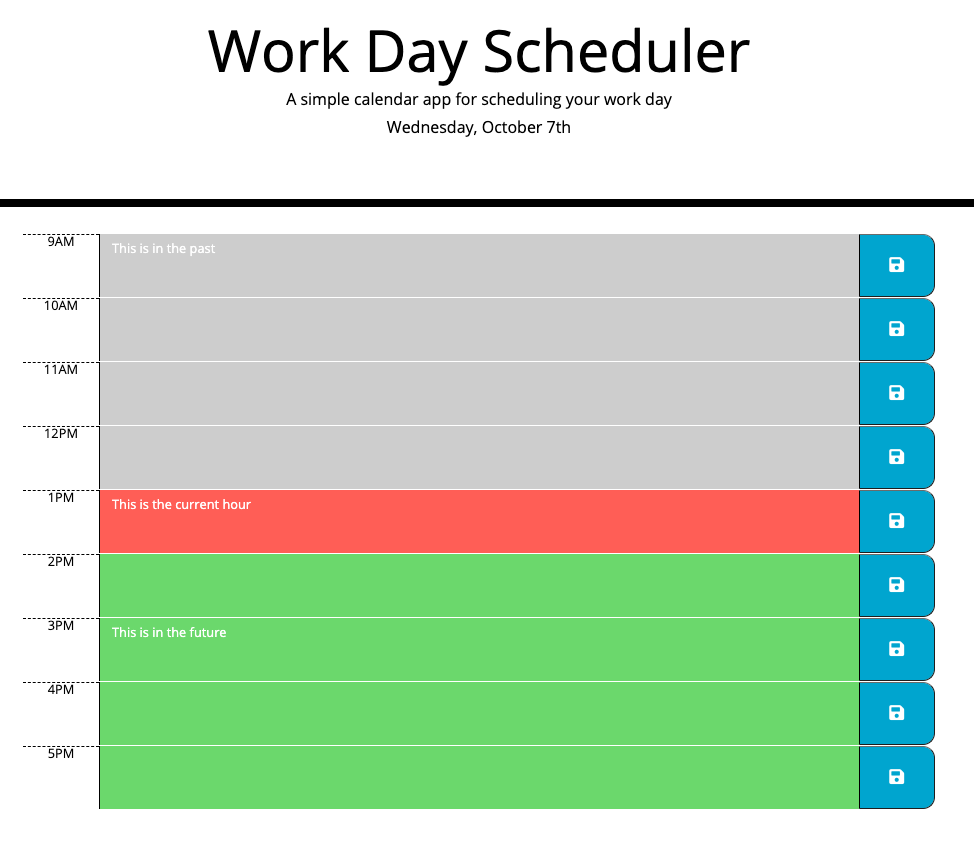

# WorkDayScheduler

David K. Brown's Work Day Scheduler

## Table of Contents

- [Description](#description)

- [Screenshots](#screenshots)

- [Acceptance-Criteria](#Acceptance-Criteria)

- [Installation](#installation)

- [Credits](#credits)

- [Contributing](#contributing)

- [Copyright](#copyright)

## Description

This website was created to provide a user the ability to enter events into a work day scheduler. As a reference point the current day of the week, month and date are displayed under the jumbotron. Within the body of the page the current hour is displayed red, past hours are gray and future hours are green. After the user inputs an event at a specific hour they are then able to select the save button. Upon selecting the save button the user's input is saved to local storage and persists on the website even after it is refreshed.

## Screenshots



## Acceptance-Criteria

```
GIVEN I am using a daily planner to create a schedule
WHEN I open the planner
THEN the current day is displayed at the top of the calendar
WHEN I scroll down
THEN I am presented with time blocks for standard business hours
WHEN I view the time blocks for that day
THEN each time block is color-coded to indicate whether it is in the past, present, or future
WHEN I click into a time block
THEN I can enter an event
WHEN I click the save button for that time block
THEN the text for that event is saved in local storage
WHEN I refresh the page
THEN the saved events persist
```

## Installation

To access this project you will need to visit my GitHub page and the "WorkDayScheduler" repository. After the repository is cloned you can make edits to the project in your repository. Any questions should be directed to [David Brown](mailto:gatech55@gmail.com). The project can be found here: [WorkDayScheduler](https://github.com/GaTech55/WorkDayScheduler). The website can be found here: [Work Day Scheduler](https://gatech55.github.io/WorkDayScheduler/).

## Credits

© 2019 Trilogy Education Services, a 2U, Inc. brand. All Rights Reserved.
[GitLab-05-Homework](https://gt.bootcampcontent.com/GT-Coding-Boot-Camp/gt-inc-fsf-pt-08-2020-u-c/tree/master/05-Third-Party-APIs/02-Homework)

## Contributing

| **Commits** | **Contributor** |

| 11 | [GaTech55](https://github.com/GaTech55)|

## Copyright

Copyright (c) 2020 David Brown.
